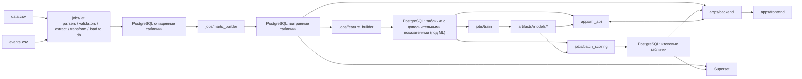

# Retail Analytics Hackathon Monorepo

## Отчеты для сдачи черновика решения
- [ML API](./docs/reports//ml_api_report_draft.md)

### Superset

- Что показывает: customer ABC/XYZ, RFM, churn by segments, логистику и возвраты, продуктовый и региональный ABC-анализ
- [Скриншот](./docs/superset/retail-notebook-bi-deep-dive-2026-04-17T08-32-20.364Z.jpg)

## Архитектура решения


---
## Общее описание решения и репозитория

Это монорепо для хакатонного проекта по retail analytics. Здесь разделены:
- продуктовый backend,
- отдельный ML API,
- frontend,
- batch/jobs,
- SQL-слой для `clean / mart / feature / serving`,
- локальная инфраструктура через Docker Compose.
В проекте намеренно не используется отдельный task runner. Все основные сценарии ниже описаны прямыми командами `docker compose`, чтобы workflow был одинаково понятен на Windows, macOS и Linux.
Docker Compose по умолчанию читает `.env` из корня репозитория, поэтому отдельный `--env-file .env` в командах не нужен.

## Что уже сделано

- `apps/backend`: FastAPI backend со stub-роутами
- `apps/ml_api`: отдельный FastAPI сервис под inference contracts
- `apps/frontend`: Next.js placeholder frontend
- `jobs/etl`: рабочий ETL для загрузки `data/raw/*.csv` в `clean.*`
- `jobs/marts_builder`: рабочий mart refresh runner для полного текущего `mart.*` слоя
- `jobs/feature_builder`, `jobs/train`, `jobs/batch_scoring`: scaffold CLI для следующих этапов пайплайна
- `sql/clean`: явный DDL контракт `clean.*`
- `sql/mart`: runnable mart-слой для продаж, customer analytics, ABC/XYZ, логистики, geography и cohorts
- `sql/feature`, `sql/serving`: заготовки под признаки и serving-слой
- `apps/backend/alembic`: foundational DDL через Alembic
- `infra/superset`: Superset с отдельной metadata DB и read-only подключением к аналитической БД

## Что пока остается заглушкой

- дополнительные бизнес-правила и обогащение поверх уже реализованного notebook-backed `clean`-слоя
- feature / serving SQL и model-serving слой
- реальный SQL runner для `feature_builder`
- обучение моделей
- batch scoring с реальными моделями
- auth
- реальные dashboard definitions

## Предпосылки по данным

- `data/raw/data.csv` — широкий денормализованный transactional dataset
- `data/raw/events.csv` — behavioral event log
- в `events.csv` может отсутствовать `user_id`
- проблемы с encoding возможны и ожидаемы
- raw CSV остаются на диске и не копируются в PostgreSQL как raw replica layer
- целевой жизненный цикл данных: `clean -> mart -> feature -> serving`

## Что сейчас делает ETL

Текущий ETL берет `data/raw/data.csv` и `data/raw/events.csv` и загружает их в typed clean tables:

- `data.csv` -> `clean.users`
- `data.csv` -> `clean.orders`
- `data.csv` -> `clean.order_items`
- `events.csv` -> `clean.events`

Для `data.csv` уже встроена логика из `notebooks/Анализ_data_csv.ipynb`:
- удаление exact duplicate rows
- исключение дублирующих колонок
- исключение `user_geom`
- исключение `distribution_center_geom`
- исключение `sold_at`
- разбиение на сущности `users / orders / order_items`
- типизация дат, чисел, координат и булевых значений

Для `events.csv` уже встроена логика из `notebooks/Анализ_data_csv.ipynb`:
- удаление exact duplicate rows
- сохранение всех event-колонок
- заполнение пропусков в `user_id` по `ip_address`, если в других deduplicated events этот `ip_address` уже связан с пользователем
- заполнение пропусков в `city` по `ip_address`, если в других deduplicated events этот `ip_address` уже связан с городом
- типизация `created_at` и `session_id`

Контракт `clean.*` хранится явно в:
- `sql/clean/clean_users.sql`
- `sql/clean/clean_orders.sql`
- `sql/clean/clean_order_items.sql`
- `sql/clean/clean_events.sql`
- ERD `clean`-слоя вынесен в [docs/architecture/clean_erd.puml](docs/architecture/clean_erd.puml)
- ERD `mart`-слоя вынесен в [docs/architecture/mart_erd.puml](docs/architecture/mart_erd.puml)

## Что сейчас делает marts-builder

Текущий `marts_builder` уже исполняет текущий runnable набор витрин из `sql/mart/`:
- `mart.sales_daily`: дневные продажи, выручка, число заказов и клиентов
- `mart.behavior_metrics`: пользовательские event/session aggregates по `clean.events`
- `mart.customer_360`: customer-level срез, который объединяет профиль, заказы и поведение
- `mart.abc_xyz`: notebook-backed ABC/XYZ анализ клиентов и retention strategies
- `mart.rfm`: notebook-backed RFM-сегментация
- `mart.logistics_metrics`: delivery/returns/problem-clients слой
- `mart.cohorts`: когорты и retention по месяцам
- `mart.product_xyz`: XYZ-анализ стабильности спроса по товарам
- `mart.region_abc`: региональный ABC-анализ по выручке
- `mart.customer_abc_monthly`: месячная динамика customer ABC-распределения
- `mart.customer_category_migration`: миграция клиентов между товарными категориями
- `mart.category_abc`: ABC-анализ товарных категорий
- `mart.brand_abc`: ABC-анализ брендов

Это уже показывает intended flow:
- `clean.*` хранит очищенные сущности
- `mart.*` хранит reusable аналитические агрегаты для BI, backend и будущих feature tables

## Структура репозитория

- `apps/`: frontend и API-сервисы
- `jobs/`: batch и offline jobs
- `sql/`: SQL-логика по слоям
- `infra/`: bootstrap и локальная инфраструктура
- `libs/`: shared Python utilities
- `data/`: локальные входные файлы
- `artifacts/`: model artifacts и будущие outputs
- `docs/`: архитектурные заметки
- `tests/`: легкие smoke tests

## Подготовка окружения

Создай `.env` из `.env.example`.

Вариант для bash:

```bash
cp .env.example .env
```

Вариант для PowerShell:

```powershell
Copy-Item .env.example .env
```

Если удобнее, файл можно просто создать вручную на основе `.env.example`.

## Настройка pre-commit

В репозитории уже есть конфиг [`.pre-commit-config.yaml`](./.pre-commit-config.yaml) с базовыми проверками:
- `ruff` и `ruff-format` для Python-кода
- базовые git/yaml hooks
- `prettier` для файлов во frontend

Универсальный способ поставить `pre-commit` и dev-зависимости:

```bash
python -m pip install -r requirements/dev.txt
```

Установить git hooks локально для репозитория:

```bash
python -m pre_commit install
```

Если хочешь сразу скачать окружения для hook'ов и проверить, что все работает:

```bash
python -m pre_commit install --install-hooks
python -m pre_commit run --all-files
```

Что это дает:
- перед каждым `git commit` будут запускаться проверки из `.pre-commit-config.yaml`
- часть проблем будет исправляться автоматически, например formatting через `ruff` и `prettier`
- тот же набор проверок можно вручную гонять в любой момент через `python -m pre_commit run --all-files`

Для `prettier` используется локальный `pre-commit` hook с отдельным Node-окружением, поэтому первый запуск может занять чуть больше времени, пока `pre-commit` подготовит это окружение.

## Быстрый старт

### 1. Поднять основной локальный стек

```bash
docker compose up -d --build
```

Эта команда:
- поднимет `postgres` и `redis`
- запустит one-shot `migrator` с `alembic upgrade head`
- после успешной миграции поднимет `backend`, `ml-api`, `frontend` и `superset`
- не будет запускать batch/job сервисы из `profiles: ["jobs"]`

### 2. Открыть сервисы

- Frontend: [http://localhost:13000](http://localhost:13000)
- Backend docs: [http://localhost:18000/docs](http://localhost:18000/docs)
- ML API docs: [http://localhost:18001/docs](http://localhost:18001/docs)
- Superset: [http://localhost:18088](http://localhost:18088)

## Основные сценарии

### Bootstrap новой локальной базы

```bash
docker compose up -d --build
```

### Полный запуск основного стека

```bash
docker compose up -d --build
```

### Остановить стек

```bash
docker compose down
```

### Посмотреть логи

```bash
docker compose logs -f --tail=200
```

### Повторно прогнать миграции

```bash
docker compose run --rm migrator
```

### Узнать текущую ревизию Alembic

```bash
docker compose run --rm migrator alembic current
```

### Загрузить clean-слой из CSV

```bash
docker compose run --rm etl
```

Это реально рабочий шаг. После него в БД появятся:
- `clean.users`
- `clean.orders`
- `clean.order_items`
- `clean.events`

### Запустить scaffold mart job

```bash
docker compose run --rm marts-builder
```

Это уже рабочий шаг. Сейчас `marts-builder` исполняет все реализованные SQL-файлы из `sql/mart/` в контролируемом порядке и пересобирает текущий mart-слой целиком.

### Запустить scaffold feature job

```bash
docker compose run --rm feature-builder
```

### Запустить scaffold training job

```bash
docker compose run --rm train
```

### Запустить scaffold batch scoring job

```bash
docker compose run --rm batch-scoring
```

### Прогнать пайплайн по шагам

```bash
docker compose run --rm etl
docker compose run --rm marts-builder
docker compose run --rm feature-builder
docker compose run --rm train
docker compose run --rm batch-scoring
```

## Работа с контейнерами и БД

### Shell в backend

```bash
docker compose run --rm backend bash
```

### Shell в ml-api

```bash
docker compose run --rm ml-api bash
```

### Shell внутри Postgres-контейнера

```bash
docker compose exec postgres sh
```

### Открыть `psql`

```bash
docker compose exec postgres sh -lc 'psql -U "$POSTGRES_USER" -d "$POSTGRES_DB"'
```

Если quoting в твоем shell неудобен, можно зайти через `sh`, а потом уже запустить:

```bash
psql -U retail -d retail_analytics
```

## Полный reset локальной БД

Эта команда удаляет локальные volumes PostgreSQL и Redis.

```bash
docker compose down -v
docker compose up -d --build
```

После этого `clean.*`, `mart.*`, `feature.*` и `serving.*` нужно собирать заново.

## Проверки

### Легкие health tests

```bash
pytest -q -s tests/test_backend_health.py tests/test_ml_api_health.py
```

### Ruff

```bash
ruff check .
```

### Форматирование

```bash
ruff format .
```

## Кто что меняет в проекте

### Backend engineer

Работает в:
- `apps/backend/`

Не лезет в:
- ETL ingestion
- SQL витрины
- training logic

### ML engineer

Работает в:
- `apps/ml_api/`
- `jobs/train/`
- `jobs/batch_scoring/`
- `sql/feature/`
- `sql/serving/`

### Data engineer

Работает в:
- `jobs/etl/`
- `jobs/marts_builder/`
- `jobs/feature_builder/`
- `sql/clean/`
- `sql/mart/`
- `sql/feature/`

### BI engineer

Работает в:
- `infra/superset/`
- `sql/mart/`
- `sql/serving/`

### Frontend engineer

Работает в:
- `apps/frontend/`

## Как будет работать разработчик витрин

После того как `clean.*` уже собран через ETL, следующий человек работает так:

1. Открывает SQL-файлы в `sql/mart/`
2. Реализует витрины, например:
   - `sql/mart/mart_sales_daily.sql`
   - `sql/mart/mart_customer_360.sql`
3. Прогоняет mart job или выполняет SQL вручную в Postgres
4. Проверяет результат через `psql` или Superset

То есть разработчик витрин не должен трогать:
- Alembic
- raw CSV ingestion
- backend API

Его зона ответственности — `mart.*` как reusable analytical layer поверх `clean.*`

## Конвенции

- Alembic используется только для foundational DDL
- аналитическая логика живет в `sql/`
- raw CSV остаются на диске
- backend и BI в норме читают `mart` и `serving`
- `clean.*` должен быть явным, обозримым и воспроизводимым
- prefer boring, explicit, maintainable structure over clever abstractions
