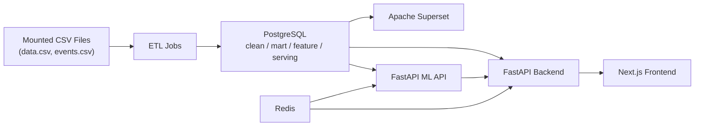
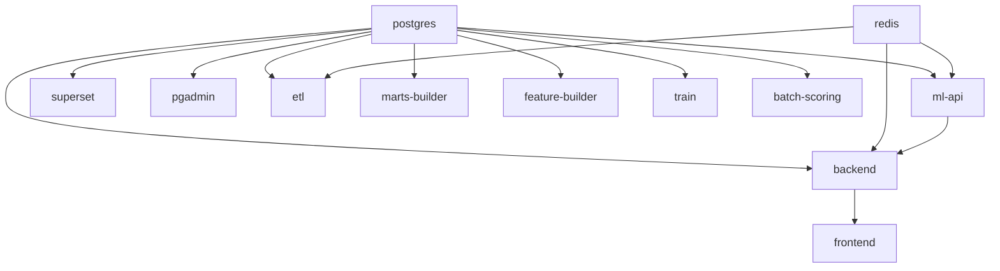

# Architecture Overview

This scaffold separates application APIs, ML interfaces, jobs, SQL, and BI assets so the team can build in parallel without blurring ownership.

## High-Level Architecture

## Docker Compose Services

## Ownership Boundaries

- Backend owns product-facing API composition.
- ML API owns inference contracts and future model loading.
- Jobs own offline/batch workflows.
- SQL folders own analytical dataset definitions.
- Superset owns BI consumption, not source-of-truth business logic.
