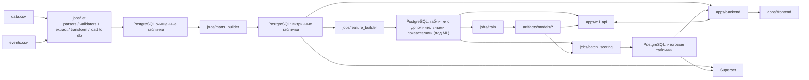
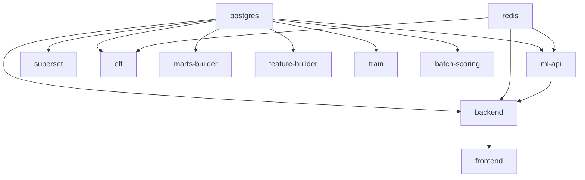

## High-Level data flow

## Docker Compose Services

## Ownership Boundaries

- Backend owns product-facing API composition and future orchestration.
- ML API owns inference contracts and future artifact loading.
- Jobs own filesystem ingestion and batch refreshes.
- SQL folders own analytical dataset definitions.
- Superset consumes `mart` and `serving` through a read-only BI user.
