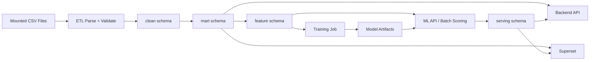
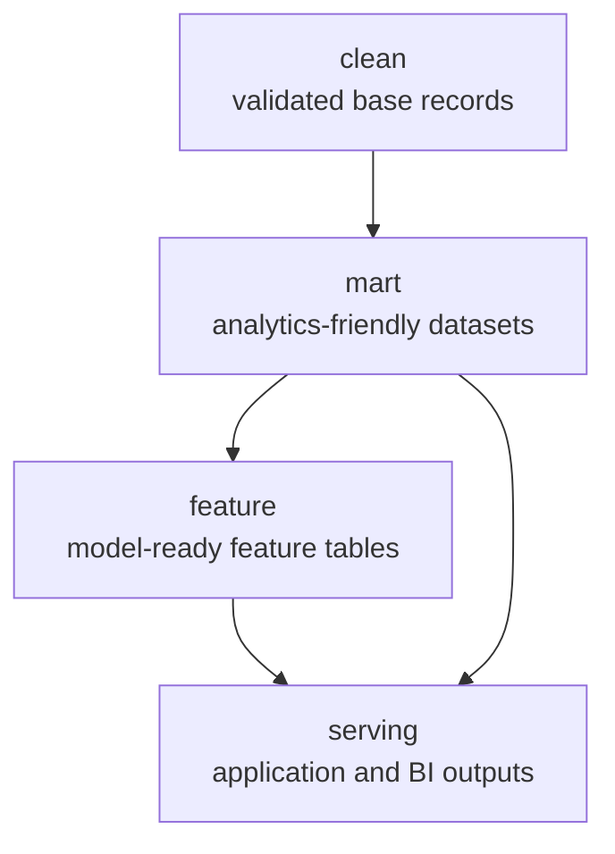

# Data Flow

The system treats the filesystem as the raw source and PostgreSQL as the home for curated analytical layers only.

## End-to-End Flow

## PostgreSQL Layer Design

## Data Assumptions

- `data.csv` is a wide denormalized transactional dataset
- `events.csv` is a behavioral event log
- `events.csv` can contain missing `user_id`
- encoding cleanup may be required during ETL
- customer identity resolution will be implemented later
- raw CSV files stay on disk and are not loaded into PostgreSQL as raw replica tables
