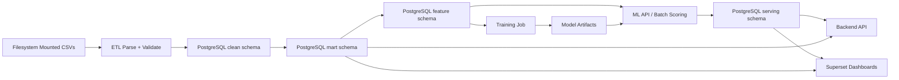
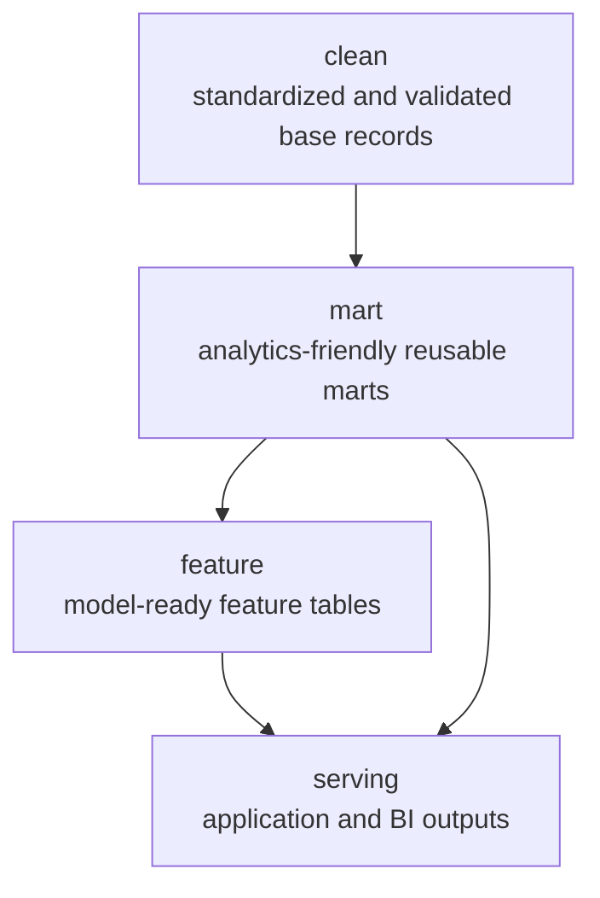

# Data Flow

The system is designed around mounted files as the raw source and PostgreSQL as the home for curated analytical layers only.

## End-to-End Flow

## PostgreSQL Layer Design

## Notes

- `data.csv` is expected to be wide and denormalized.
- `events.csv` can contain missing `user_id` values and encoding issues.
- Raw files stay on disk; ETL jobs are responsible for parsing and loading curated structures.
