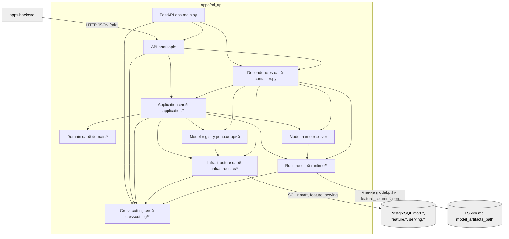
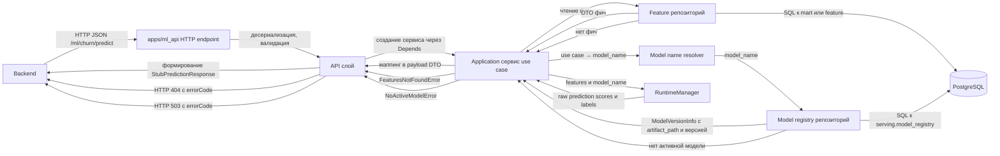

## Компоненты и ответственность

- **FastAPI app (`main.py`)** - инициализирует приложение, настраивает lifespan, регистрирует роутеры и exception‑handlers.
- **API‑слой (`api/*`)** - описывает HTTP‑эндпоинты и Pydantic‑схемы запросов/ответов, пробрасывает вызовы в application‑сервисы.
- **Application‑слой (`application/*`)** - оркестрирует use case: читает фичи через репозитории, резолвит модель, вызывает RuntimeManager, маппит результат в payload.
- **Domain‑слой (`domain/*`)** - задает протоколы репозиториев и RuntimeManager, DTO фич/предсказаний, доменные исключения.
- **Infrastructure‑слой (`infrastructure/*`)** - реализует репозитории поверх Postgres (SQL через SQLAlchemy Core), создает DB engine и фабрику соединений.
- **Runtime‑слой (`runtime/*`)** - загружает модельные артефакты с диска, хранит модели и feature_columns, реализует методы predict по use case.
- **Cross‑cutting (`crosscutting/*`)** - реализует логирование, метрики и трассировку, не содержит бизнес‑логики.
- **Dependencies (`dependencies/container.py`)** - собирает граф зависимостей (engine, репозитории, RuntimeManager, сервисы) и предоставляет фабрики для FastAPI `Depends`.
- **Model registry (`domain/infrastructure modelregistry`)** - читает `serving.model_registry`, отдает активную версию модели по имени.
- **Model name resolver (`domain/runtime`)** - сопоставляет use case (например, `churn`) с техническим `model_name` в registry.

## Путь клиентского запроса

