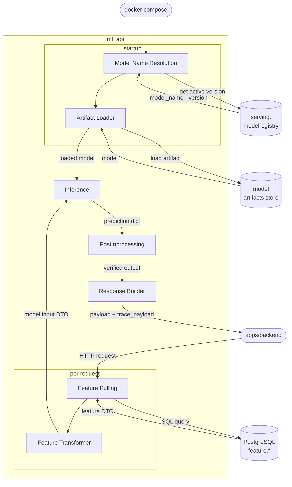

# ml_api - сервис онлайн-инференса

Микросервис на FastAPI, обслуживающий онлайн-предсказания для четырех ML-задач:
**Churn Prediction**, **Recommendations**, **Sales Forecast**, **Segmentation**.
Принимает HTTP-запросы от `apps/backend`, самостоятельно забирает признаки и запускает инференс.

---

## Endpoints

| Endpoint | Задача | Ключевые поля ответа |
|---|---|---|
| `POST /ml/churn/predict` | Вероятность оттока клиента | `churn_probability`, `churn_bucket`, `top_factors` |
| `POST /ml/recommendations/predict` | Персональные рекомендации товаров | `items[].item_id`, `items[].score`, `reason` |
| `POST /ml/forecast/predict` | Прогноз продаж по горизонту до 365 дней | `forecast[].date`, `forecast[].value` |
| `POST /ml/segmentation/predict` | RFM-сегментация клиентов | `segment`, `rfm_code`, `cluster_id` |
| `GET /ml/health` / `GET /ml/ready` | Liveness & Readiness checks | - |

---

## Возможности

- **Model Registry** - автоматическое разрешение активной версии модели через `serving.modelregistry`
- **Feature pulling** - чтение признаков из `PostgreSQL feature.*` через типизированные репозитории под каждый use case
- **Feature → Model Input transform** - преобразование feature DTO в model input DTO на уровне application-сервиса
- **Observability** - `request_id` / `correlation_id`, latency и error counters по endpoint/use case, `trace_payload` в ответе (feature flag)
- **Единый response envelope** - `payload` + `tracepayload` для всех use case, совместим с `apps/backend`

---

## Архитектура

