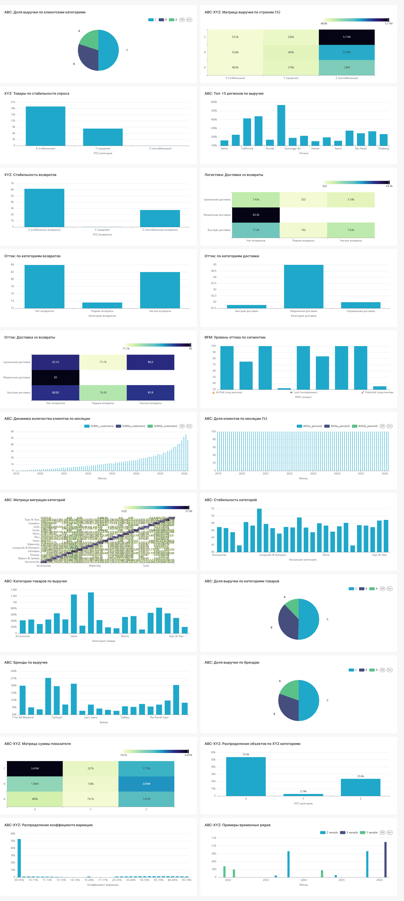

# Retail Retention Control Room

## Тизер решения

**Retail Retention Control Room** — это единое аналитическое приложение для управления клиентским опытом в ритейле. Решение объединяет продуктовую аналитику, прогноз оттока, персонализированные рекомендации, прогноз продаж и встроенный BI-контур в одном интерфейсе.

Платформа закрывает полный цикл принятия решений:
- показывает, что происходит с продажами и клиентской базой;
- выявляет клиентов с повышенным риском оттока;
- объясняет, какие факторы тянут риск вверх;
- подбирает удерживающие рекомендации;
- дает возможность провалиться в глубокую аналитику без выхода из продукта.

---

## Что получает бизнес

### 1. Единый центр управления удержанием

Пользователь работает не с набором разрозненных инструментов, а с одним продуктовым контуром:
- обзор бизнеса и клиентской базы;
- customer 360 по каждому клиенту;
- очередь high-risk клиентов;
- персональные рекомендации для реактивации;
- прогноз продаж для операционного планирования;
- встроенный BI deep dive для дополнительного анализа.

### 2. Переход от реактивного управления к проактивному

Решение не ограничивается retrospective analytics. Оно помогает перейти к action-oriented сценарию:
- увидеть риск;
- понять причину;
- выбрать удерживающее действие;
- проверить эффект на дашбордах.

### 3. Одна архитектура для продукта, ML и BI

Система изначально разделена по слоям:
- **backend** отвечает за product-facing API;
- **ml_api** отвечает за inference contracts;
- **Superset** отвечает за BI и deep-dive аналитику;
- **frontend** собирает это в единый пользовательский сценарий.

Такой подход делает решение понятным для разработки, масштабирования и защиты.

---

## Что уже реализовано в текущем MVP

### Продуктовый frontend

Во фронте собраны основные экраны, которые формируют демонстрационный product flow:

- **Overview**
  Главная точка входа. Показывает состояние бизнеса, клиентской базы, churn-сигналы и ключевые направления действия.

- **KPI Dashboard**
  Быстрый слой для мониторинга продаж, здоровья клиентской базы и логистических метрик.

- **Customer 360**
  Карточка клиента с профилем, заказами, поведением, сегментом, метриками активности и контекстом для retention-решений.

- **Churn**
  Экран high-risk клиентов и сигналов оттока. Позволяет быстро перейти от риска к конкретному клиенту.

- **Recommendations**
  Показывает, какие товары и категории стоит предложить пользователю для реактивации и удержания.

- **Forecast**
  Отдельный экран для прогноза продаж и обзора будущей динамики.

- **BI Deep Dive**
  Встроенный прямо во frontend Superset dashboard `retail-notebook-bi-deep-dive` через Embedded SDK и guest token.

Это не отдельный BI-портал рядом с продуктом, а часть единого пользовательского опыта.

---

## Встроенный Superset внутри продукта

В приложение встроен полноценный BI-контур на базе Superset.
Пользователь может перейти на вкладку **BI Deep Dive** и работать с интерактивным дашбордом прямо внутри фронта:
- фильтровать данные;
- проваливаться в сегменты;
- смотреть ABC / XYZ / RFM аналитику;
- анализировать логистику, возвраты, категории, бренды, географию и churn-сигналы.

Скриншот текущего состояния deep-dive dashboard:

Ключевой момент: BI не живет отдельно от продукта. Он встроен в тот же сценарий, где пользователь видит churn, рекомендации и customer 360.

---

## Data foundation

Решение опирается на полноценный data pipeline внутри репозитория.

### Источники данных

Используются два исходных CSV-файла:
- `data.csv` — транзакции, пользователи, товары, логистика, отзывы;
- `events.csv` — событийный лог клиентского поведения.

### ETL и clean-слой

На этапе ETL данные:
- дедуплицируются;
- очищаются по notebook-backed логике;
- типизируются;
- раскладываются по сущностям в PostgreSQL.

Финальный clean-слой уже представлен таблицами:
- `clean.users`
- `clean.orders`
- `clean.order_items`
- `clean.events`

На этом уровне данные уже пригодны для продуктовой аналитики и следующих агрегирующих слоев.

### Mart-слой

Поверх clean-слоя построен mart-контур, который закрывает ключевые аналитические задачи кейса:

- `mart.sales_daily`
- `mart.behavior_metrics`
- `mart.customer_360`
- `mart.rfm`
- `mart.abc_xyz`
- `mart.logistics_metrics`
- `mart.cohorts`
- `mart.product_xyz`
- `mart.region_abc`
- `mart.customer_abc_monthly`
- `mart.customer_category_migration`
- `mart.category_abc`
- `mart.brand_abc`
- `mart.rfm_churn_by_segment`

Это уже не сырые таблицы, а готовые аналитические витрины для:
- backend API;
- Superset;
- feature engineering;
- дальнейшего model-serving.

---

## BI и аналитика

Текущий набор витрин и дашбордов покрывает основные аналитические темы из кейса:

### Анализ розничных продаж
- дневная динамика выручки и заказов;
- ABC-анализ категорий и брендов;
- региональный анализ выручки;
- product-level XYZ по стабильности спроса.

### Клиентская аналитика
- customer 360;
- RFM-сегментация;
- ABC/XYZ-анализ клиентской базы;
- cohort analysis;
- распределение клиентских стратегий.

### Аналитика качества и логистики
- возвраты;
- устойчивость возвратов;
- связь доставки и возвратов;
- сегменты риска по логистическому контуру.

### Аналитика оттока
- churn by segments;
- связь churn с логистикой и возвратами;
- риск-контур внутри product-facing API.

---

## ML и предиктивный слой

В решении уже выделен отдельный `ml_api`, который изолирует модельный слой от backend и фронта.

Сервисный контур включает:
- `churn`
- `forecast`
- `recommendations`
- `segmentation`

Такое разделение дает две вещи:
- фронт и backend не зависят от внутренней реализации моделей;
- inference можно развивать отдельно от продуктового API.

Даже на текущем этапе это уже выглядит как зрелый каркас прикладной ML-системы, а не просто набор ноутбуков.

---

## Product flow для демонстрации

Сценарий демонстрации решения выглядит так:

1. Открыть **Overview** и показать общую картину по бизнесу.
2. Перейти в **Churn** и выбрать high-risk клиента.
3. Открыть **Customer 360** и показать профиль, активность, RFM и историю взаимодействия.
4. Перейти в **Recommendations** и показать action layer: что именно система предлагает клиенту.
5. Открыть **Forecast** и показать прогноз продаж.
6. Перейти в **BI Deep Dive** и показать глубокую аналитику по ABC / XYZ / RFM / churn / логистике.

Этот flow хорошо ложится на постановку задачи:
**аналитика -> прогноз риска -> персонализированное действие -> мониторинг результата**.

---

## Архитектурная схема решения

Решение разложено на понятные технологические блоки:

- **PostgreSQL**
  Единое аналитическое хранилище для `clean`, `mart`, `feature`, `serving`.

- **ETL / marts_builder**
  Batch-слой для очистки, типизации и построения витрин.

- **backend**
  Product-facing API для фронта и orchestration-слой между данными, Superset и `ml_api`.

- **ml_api**
  Отдельный сервис для inference и model contracts.

- **frontend**
  Пользовательский интерфейс MVP-приложения.

- **Superset**
  BI-контур для deep-dive анализа и storytelling.

Именно такое разделение и требуется в кейсе: backend, ML-интерфейсы и BI-уровень разделены явно.

---

## Почему решение выглядит целостно уже сейчас

Это важно: текущий результат — не просто набор отдельных артефактов.

Сейчас уже есть:
- рабочий data pipeline;
- очищенные и типизированные таблицы в PostgreSQL;
- набор аналитических витрин;
- Superset dashboards;
- отдельный backend;
- отдельный `ml_api`;
- кастомный frontend;
- встроенный BI deep dive прямо в приложение.

То есть решение уже выглядит как собранный end-to-end контур:
- данные приходят;
- приводятся в рабочий вид;
- агрегируются;
- используются в BI;
- используются во frontend;
- проходят через выделенный ML boundary.

---

## Итоговый образ решения

**Retail Retention Control Room** — это MVP аналитического приложения для ритейла, которое объединяет:
- диагностику проблем через аналитические витрины и BI;
- прогнозный контур для churn и forecasting;
- персонализированные рекомендации;
- единый продуктовый интерфейс для демонстрации всей связки.

Это решение можно показывать как:
- систему мониторинга здоровья клиентской базы;
- инструмент для проактивного удержания;
- аналитический слой для продуктовых и коммерческих решений;
- технологически зрелый каркас для дальнейшего развития ML и serving-контура.

В текущем виде проект уже демонстрирует не просто идею, а **рабочую платформу, которая объединяет данные, аналитику, ML и интерфейс в одном контуре**.
